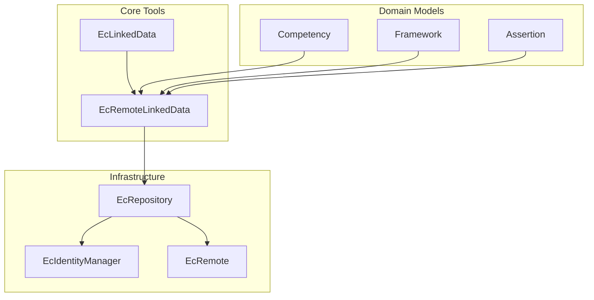

# Architecture & System Walkthrough

This document provides a comprehensive overview of the `cass-npm` library's architecture, its core components, and common workflows.

## 1. Core Architecture Overview

The library follows a modular architecture, leveraging a package-like structure that reflects its transition from a Java-based implementation.

## 2. Directory Structure

- `index.js`: Main entry point in the root.
- `src/index/`: Core library setup and lifecycle management.
    - `env.js`: Environment-level setup (UUID, Crypto initialization).
    - `polyfills.js`: Java-like prototype extensions.
    - `exports.js`: Global component exports.
- `src/com/eduworks/`: Core framework and utility classes.
    - `ec/crypto/`: Cryptographic implementations and workers.
    - `ec/graph/`: Competency and framework graph processing.
    - `ec/remote/`: Repository communication logic.
- `src/org/`: Standardized organization-level data models and logic.
    - `cassproject/`: CaSS-specific data structures and identity management.
    - `credentialengine/`: Credential Engine / CTDL implementations.
    - `schema/`: Standardized Schema.org models.
- `src/test/`: Unit and integration tests.
- `documentation/`: Project documentation and specifications.
- `docker/`: Build and test environment configurations.

## 3. Core Components

### 3.1 Linked Data (`EcLinkedData`, `EcRemoteLinkedData`)
Foundational classes for all CaSS objects. They handle JSON-LD serialization, context management, and object dynamic casting.
- **Key Methods**: `toJson()`, `atIfy()`, `copyFrom()`, `recast()`.

### 3.2 Identity & Security (`EcIdentityManager`, `EcCrypto`)
Manages cryptographic keys (`EcPpk`, `EcPk`), user identities, and signatures.
- **Key Features**: Signature sheet generation, local key persistence, AES/RSA worker-based processing.

### 3.3 Repository Operations (`EcRepository`)
The primary interface for interacting with a CaSS server. 
- **Key Features**: L1 (memory) and L2 (IndexedDB) Caching, multi-repository search, automated signing on save.

### 3.4 Competency Graph (`EcFrameworkGraph`)
Calculates relationships between competencies, including implications and assertions for gap analysis.

## 4. Key Workflows

### 4.1 Saving an Object
1. Create a model instance (e.g., `new Competency()`).
2. Populate data and set owners.
3. Call `repository.save(object)`.
4. `EcRepository` automatically generates a signature sheet using `EcIdentityManager` and performs a signed POST request.

### 4.2 Searching for Objects
1. Use `repository.search(query)` or `repository.find(url)`.
2. The library handles URL parameters, pagination, and returns deserialized objects cast to their appropriate classes.

## 5. Modularization & Lifecycle

The library initialization is handled in `src/index/`:
- `env.js`: Initializes global `crypto` and `UUID` generation.
- `polyfills.js`: Extends native prototypes (e.g., `String.prototype.contains`) used by the legacy core.
- `exports.js`: Maintains backward compatibility by exporting components to the `global` namespace.

## 6. Testing & Quality

- **Unit Tests**: Mocha tests in `src/test/`.
- **Integration Tests**: Cypress-based end-to-end testing.
- **Cryptographic Baseline**: Verified via `npm run mochaCrypto` to ensure algorithm correctness across environments.
